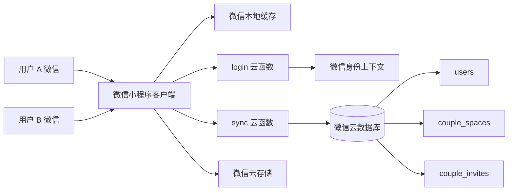
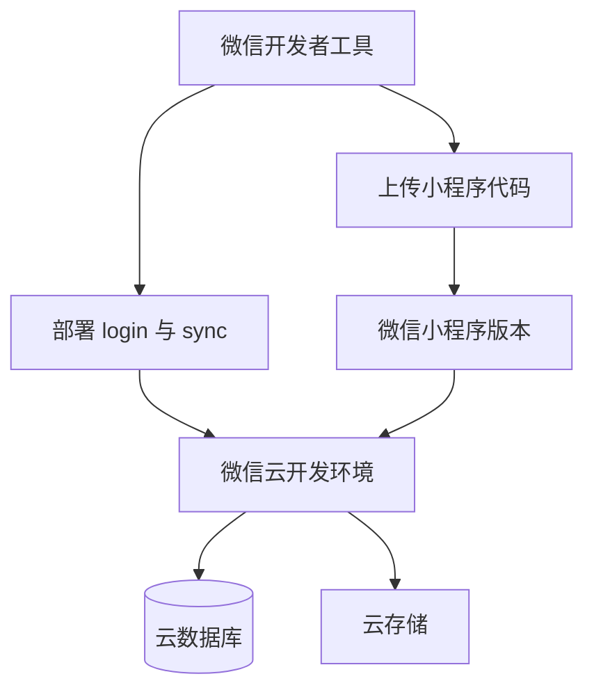

# 系统架构文档

## 1. 总体架构



客户端负责页面交互、本地状态和离线体验；云函数负责身份识别、情侣空间访问控制与状态同步；云数据库保存用户和情侣空间状态；云存储保存饮食照片。

## 2. 目录结构

```text
cloudfunctions/
  login/                 微信登录身份确认
  sync/                  状态同步、邀请、绑定与解绑
docs/                    产品、架构、部署、接口和测试文档
miniprogram/
  assets/                菜品图片等静态资源
  pages/                 小程序页面
  utils/                 状态、同步、菜品、健康与菜谱工具
  app.js                 应用启动和云环境初始化
  app.json               页面、窗口和底部导航配置
  config.js              云环境 ID 占位配置
tests/                   结构验证与同步集成测试
project.config.json      微信开发者工具项目配置
```

## 3. 客户端页面架构

### 底部导航页面

- `pages/home/home`：今日决策与快速确认。
- `pages/logs/logs`：本人和伴侣的饮食时间线。
- `pages/recipes/recipes`：本周主题与菜谱发现。
- `pages/couple/couple`：情侣空间、相伴天数和设置入口。

### 二级页面

- `pages/plan/plan`：七日带饭与外卖计划。
- `pages/draw/draw`：完整筛选式抽取页面，保留为兼容入口。
- `pages/log-edit/log-edit`：详细新增和编辑饮食记录。
- `pages/report/report`：本周饮食趋势。
- `pages/moments/moments`：历史独立动态页，数据已合并到记录时间线。
- `pages/profile/profile`：预算、忌口、自定义菜品和奖励设置。
- `pages/recipe-detail/recipe-detail`：菜谱食材、步骤和收藏。

## 4. 状态模型

客户端状态由 `miniprogram/utils/store.js` 管理，使用微信本地缓存保存。核心字段包括：

| 字段 | 说明 |
|---|---|
| `profile` | 昵称、预算、忌口与共享选项 |
| `couple` | 情侣空间、伴侣名称和相伴起点 |
| `plans` | 日期对应的带饭或外卖计划 |
| `logs` | 饮食记录、标签、金额、可见范围 |
| `draws` | 菜品选择历史与确认状态 |
| `moments` | 文字和图片动态，展示时合并进记录时间线 |
| `weeklyTheme` | 当前周尝鲜主题 |
| `weeklyReward` | 当前周情侣奖励 |
| `recipeFavorites` | 收藏菜谱 ID |

## 5. 云端数据模型

### users

- 文档 ID：微信 OpenID。
- 保存字段：本人状态、情侣空间 ID、更新时间。

### couple_spaces

- `memberIds`：最多两个成员 OpenID。
- `memberStates`：双方状态快照。
- `sharedDraw`：最近一次共享选择结果。

### couple_invites

- 文档 ID：六位邀请码。
- 保存创建人、空间 ID、有效期、使用状态和使用人。

三个集合都应配置为仅云函数可读写。

## 6. 云函数接口

`login` 返回当前微信用户身份；`sync` 根据 `action` 分发：

- `push`：保存本人状态并更新情侣空间快照。
- `pull`：读取本人、伴侣和共享结果。
- `createInvite`：创建空间和一次性邀请码。
- `joinInvite`：校验邀请码并加入情侣空间。
- `shareDraw`：写入最近共享选择。
- `unbind`：解除双方空间关系。

详细参数见 `docs/API.md`。

## 7. 安全边界

- 客户端不保存 AppSecret，也不能持有服务端密钥。
- OpenID 只从 `cloud.getWXContext()` 获取。
- 客户端提交的状态被限定在本人和已绑定空间范围内。
- 公开仓库使用 `XXXXXXXX` 代替 AppID 和云环境 ID。
- 真实配置不得写入 Git 历史、文档、截图或压缩包。
- 云数据库权限必须拒绝客户端直接访问。

## 8. 部署拓扑



小程序代码上传和云函数部署是两个独立动作。仅修改页面通常不需要重新部署云函数；修改 `cloudfunctions` 后必须重新部署对应函数。

## 9. 测试与运维

- `node tests/validate.js`：验证页面文件、JSON、WXML 和云函数动作。
- `node tests/cloud-sync.integration.js`：模拟两名用户邀请、加入、同步、共享和解绑。
- 上线前需真机验证图片上传、订阅权限、两人同步和弱网场景。
- 云开发控制台应设置资源用量告警、错误告警和定期备份。
