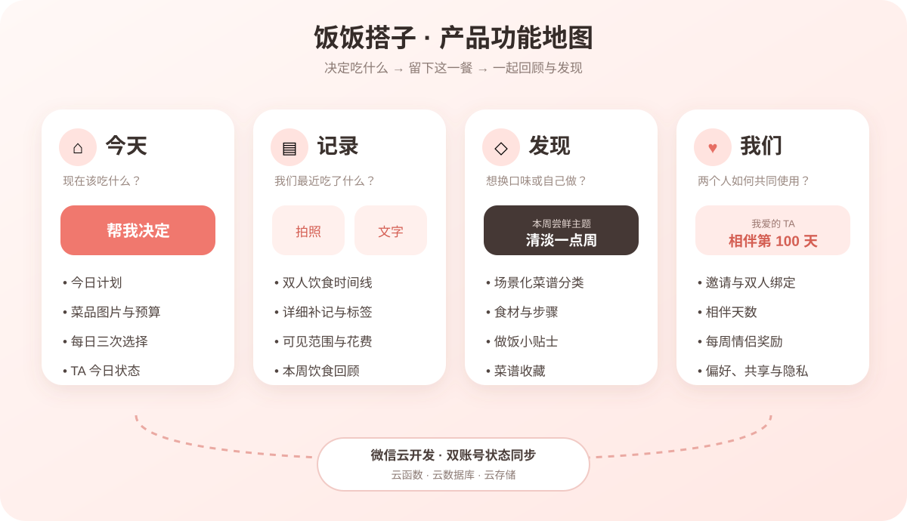
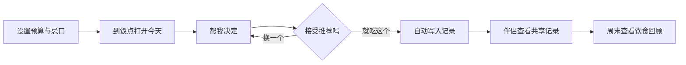
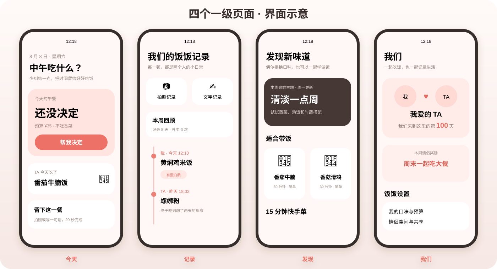

# 产品说明

> 一句话理解：饭饭搭子帮助情侣快速决定吃什么、轻松记录这一餐，并在两个人之间自然共享。

## 1. 产品定位

饭饭搭子是一款情侣吃饭决策与记录小程序。核心价值不是提供海量菜品或专业营养分析，而是帮助两个人减少“今天吃什么”的纠结，并沉淀轻量、有温度的共同饮食记录。

## 2. 目标用户

- 工作日需要带饭、点外卖或在食堂就餐的人。
- 容易产生选择困难，希望快速获得一个可接受结果的人。
- 希望与伴侣共享饮食状态、计划和小奖励的情侣。

## 3. 核心用户旅程

1. 用户设置预算、忌口和自定义菜品。
2. 到饭点进入“今天”，点击“帮我决定”。
3. 系统在可选范围内推荐菜品，允许有限次数更换。
4. 用户点击“就吃这个”，系统自动创建饮食记录。
5. 用户也可通过拍照、文字或详细表单补充一餐。
6. 绑定伴侣后，双方可以查看共享记录和最新状态。
7. 周末通过饮食回顾查看外卖、带饭和健康标签趋势。

## 4. 一级模块

| 模块 | 核心目标 | 主要功能 |
|---|---|---|
| 今天 | 快速决定当前一餐 | 今日计划、菜品推荐、TA 今日状态 |
| 记录 | 留下并回顾两人的饮食 | 双人时间线、拍照、文字、详细记录、周报 |
| 发现 | 尝试新味道 | 本周主题、菜谱分类、详情、收藏 |
| 我们 | 管理情侣关系和偏好 | 邀请绑定、相伴天数、奖励、设置、隐私 |

## 5. 主要页面预览

### 今天

页面只突出“帮我决定”这一个主要动作。用户确认菜品后自动生成记录，并能直接看到伴侣当天的最新一餐。

### 记录

饮食日志与情侣动态合并为双人时间线。拍照、文字记录适合快速使用，详细补记用于维护日期、金额、标签和备注。

### 发现

本周尝鲜主题用于减少长期口味重复；小菜讲堂按照带饭、快手、清淡等场景帮助用户挑选菜谱。

### 我们

集中展示情侣绑定状态、伴侣名称、相伴天数、每周奖励、饮食回顾、口味偏好和共享设置。

## 6. 页面与功能对应

| 页面 | 页面路径 | 核心功能 | 主要去向 |
|---|---|---|---|
| 今天 | `pages/home/home` | 今日计划、快速推荐、确认一餐、TA 今日状态 | 周计划、记录 |
| 记录 | `pages/logs/logs` | 双人时间线、拍照、文字、筛选 | 详细补记、周报 |
| 发现 | `pages/recipes/recipes` | 本周主题、菜谱分类、收藏 | 菜谱详情 |
| 我们 | `pages/couple/couple` | 邀请绑定、相伴天数、奖励、设置 | 偏好设置、周报 |
| 周计划 | `pages/plan/plan` | 设置带饭、外卖和提醒计划 | 今天 |
| 详细记录 | `pages/log-edit/log-edit` | 日期、时间、金额、标签、备注 | 记录 |
| 饮食回顾 | `pages/report/report` | 本周指标、上周对比、温和提示 | 记录/我们 |
| 菜谱详情 | `pages/recipe-detail/recipe-detail` | 食材、步骤、小贴士、收藏 | 发现 |

## 7. 业务规则

- 每个用户每天最多获得三次菜品选择机会。
- 同一次抽取确认只生成一条饮食记录。
- 本周尝鲜主题每周只生成一次，周一刷新。
- 情侣奖励每周只领取一次，周一刷新。
- 情侣空间最多绑定两名微信用户。
- 邀请码为六位字符、24 小时有效且仅能使用一次。
- 单人模式允许使用本地功能；情侣同步需要云开发环境。
- 健康标签仅作生活记录，不提供医疗结论。

## 8. 数据与隐私

- 微信身份由云函数运行上下文取得，客户端不传 OpenID。
- 情侣空间数据只允许空间内两名成员通过云函数访问。
- 数据库集合应禁止客户端直接读写。
- 图片存储在当前小程序所属的微信云存储中。
- 用户解除绑定后保留各自本地和个人状态，解除情侣空间关系。

## 9. 当前版本边界

当前版本不接入外卖平台实时菜单，不提供 AI 营养识别，不包含广告系统、公开社区、支付和办公文档工具。
